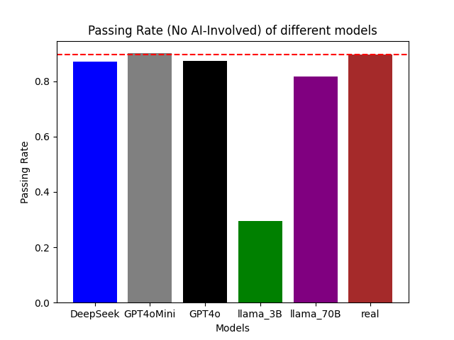
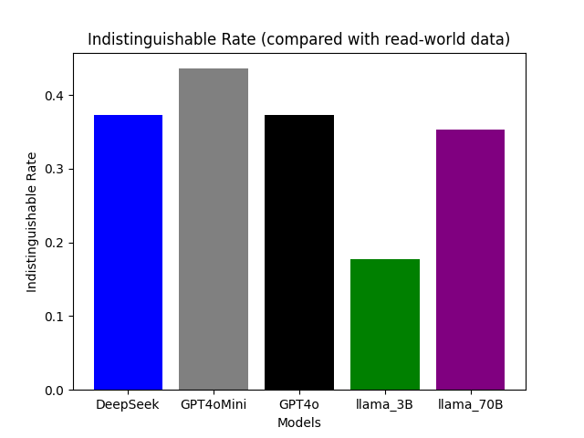
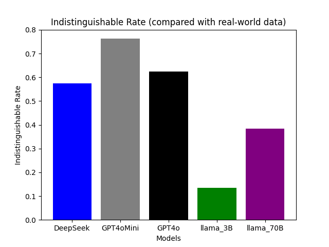

# The Evaluation Results (ChatGPT4o as the Evaluator)

## Uni Eval

### Passing Rate (No AI involved)
Read-world Human-Chatbot Conversations: 89.588%  
llama_3B: 29.540%  
llama_70B: 81.598%  
GPT4oMini: 90.073%  
GPT4o: 87.409%  
DeepSeek: 87.167%   

## Pair Eval

### GPT4o VS ✅ GPT4oMini
GPT4o Better: 8.232%  
GPT4oMini Better: 38.983%  
Both Falied the Test: 29.298%  
Both Pass the Test: 23.487%  
 

### GPT4o VS ✅ DeepSeek
GPT4o Better: 13.075%  
DeepSeek Better: 23.971%  
Both Falied the Test: 40.194%  
Both Pass the Test: 22.760%  

### ✅ GPT4o VS llama_70B
GPT4o Better: 29.298%  
llama_70B Better: 22.518%  
Both Falied the Test: 40.436%  
Both Pass the Test: 7.748%  

### ✅ llama_70B VS llama_3B
llama_70B Better: 67.797%  
llama_3B Better: 5.327%  
Both Falied the Test: 25.182%  
Both Pass the Test: 1.695%  

### ✅ GPT4oMini vs DeepSeek
GPT4oMini Better: 44.552%  
DeepSeek Better: 6.780%  
Both Falied the Test: 26.150%  
Both Falied the Test: 22.518%  

### ✅ GPT4oMini vs llama_70B
GPT4oMini Better: 60.533%  
llama_70B Better: 6.780%  
Both Falied the Test: 27.119%  
Both Falied the Test: 5.569%  

## Gt Eval

### Indistinguishable Rate (compared with real-world data)
llama_3B:   17.676%  
llama_70B:   35.351%  
GPT4oMini:  43.584%  
GPT4o: 37.288%  
DeepSeek: 37.288%  

# The Evaluation Results (DeepSeek as the Evaluator)

## Uni Eval

### Passing Rate (No AI involved)
Read-world Human-Chatbot Conversations: 85.44%  
llama_3B: 68.04%  
llama_70B: 90.56%  
GPT4oMini: 90.56%  
GPT4o: 89.59%  
DeepSeek: 88.86%   

## Gt Eval

### Indistinguishable Rate (compared with real-world data)
llama_3B:   13.56%  
llama_70B:   38.50%  
GPT4oMini:  76.27%  
GPT4o: 62.47%  
DeepSeek: 57.38%  

