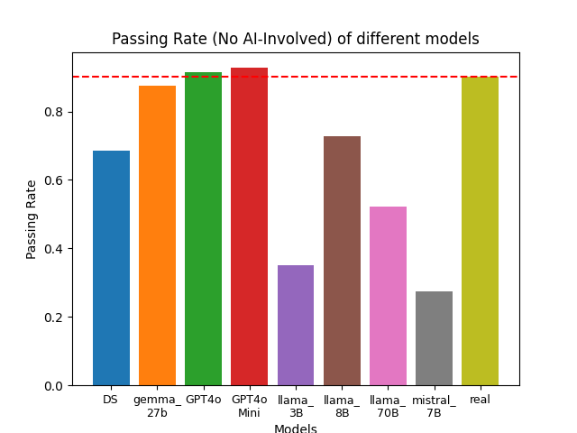
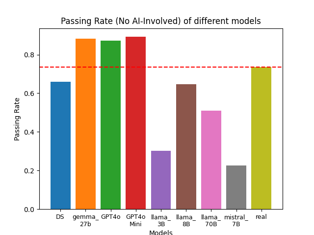
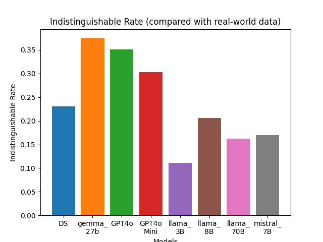
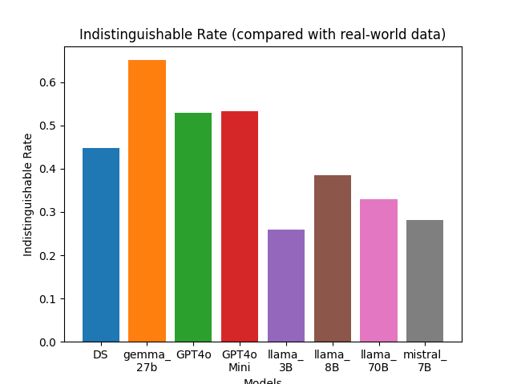

# Evaluation

## uni_eval

## oasst dataset (6-turns)
  

## arena dataset (6-turns)
  

## gt_eval
## oasst dataset (6-turns)
  

## arena dataset (6-turns)
 

## pair_eval

## oasst dataset (6-turns)  

### gemma_27B VS ✅ GPT4o
gemma_27B Better: 21.79%  
GPT4o Better: 26.15%  
Both Falied the Test: 44.07%  
Both Pass the Test: 7.99%

### ✅ llama_8B VS llama_70B
llama_8B Better: 7.51%  
llama_70B Better: 4.12%  
Both Falied the Test: 85.48%  
Both Pass the Test: 2.91%

## arena dataset (6-turns)  

### gemma_27B VS ✅ GPT4o
gemma_27B Better: 21.16%  
GPT4o Better: 29.24%  
Both Falied the Test: 40.32%  
Both Pass the Test: 9.28%  

### llama_8B VS ✅ llama_70B
llama_8B Better: 7.68%  
llama_70B Better: 8.68%  
Both Falied the Test: 79.94%  
Both Pass the Test: 3.69%  
